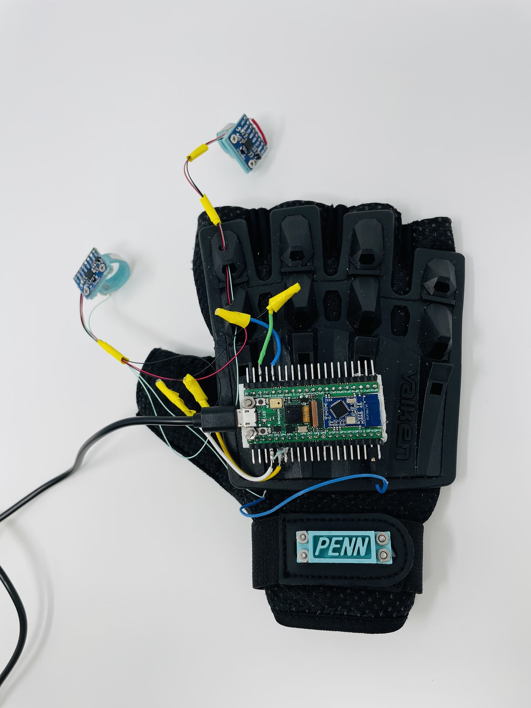
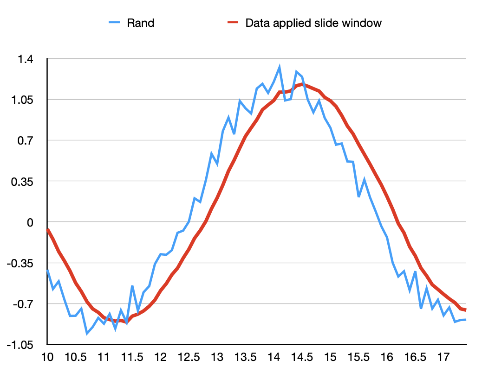

# ESE 5060 Final Project (Team Dark Moon): A Mouse-keyboard System Embedded on A Glove

## I - Overview
### 1.1 What is it?
* We designed a mouse-keyboard system which have the curser moving, right clicking, left clicking, and gesture writing functions.
* User can achive the curser function by rotating hand and can achived the clicking function by shaking fingers in the air. The keyboard function is under implementation.

### 1.2 How to use it?
* **Cursor Movement:** There're two metal panels on these two rings. When you want to move the cursor, just hold these two fingers and let metal contact. The movment direction follows the direction of your palm. Relase fingers can stop moving cursor.
* **Right and Left Clicking:** A click can be done anytime you want. Just act like you are clicking mouse using your thumb(left click) or index finger(right click).

### 1.3 How did we achieve this?
* We use one IMU to catch orientation change happening on the hand. The accelerometer data is parsed into angles between zx, yx(capture movment inside yz plane). A moving distance corresponds to the angle between z-axis and x-axis and y-axis and x-axis. S.t. a larger angle corresponds to a long movment. We applied sliding window algorithm to smooth data,which average new collected data and previous some data in a time window. This simple and good at reducing noise. 
* We also applied one IMU on thumb and one on index finger to catch an accident and fast movment for clicking use.

### 1.4 Where did we apply PIO program?
* Unfortunately we didn't applied PIO in our program at last. We intended to use it to do addition at the beginning based on bit operation `x + y == ~(~x - y)`. We will explain this later. 

### 1.5 What we haven't done:
* Actually our inital design is a device intergrated mouse and keyboard functions. In our inital plan, keyboard can be achived by adjusting Arducam's magic-wand-ble example and combining tinyusb's HID API.
* We didn't accomplish keyboard function, but we did want to let you know that we also spent lots of time on that function. There're still two issues unresloved in keyboard part:
  * Although we already trained a model that can recognize 26 character and digits, the trained model cannot be deployed on board because some unidentifed errors;
  * We haven't understand the logic to use keyboard API from tinyusb, we didn't find the release keycode method before project deadline. 
---
## II - Mouse Functions
### 3.1 Data filter
The raw data accessed from the IMU sensor contained extensive noise, which complicated the problem. Therefore, to acqurie a clean data, we needed to apply a filter to smooth the raw data. We compared slide window filter and Kalman filter and decided to use slide window because of the adaptabiltiy and simple execution. It mainly averaged the past data in a fixed window size plus the current data. By adjusting the windows size, we can acquire data in different smooth level. A slide window example is displayed below, effects can be easily observed. 

### 3.2 Cursor Position Computation 
The cursor position is determined by palm direction, instead of palm position. Because position requires integrate the accelerometer data twice, and any small error will accumulate into a large error, which lead to a inaccurate and unstable result. Instead, we use the accelerometer to estimate the gravity direction and obtain a more accurate angle estimation. The gravity is calculated by the mean of a few acceleration(force) data before, the current angle to x,y axis is acquired by "atan" function. Finally, the angles will map to position linearly.

Here is the how it works. When your hand is place horizontally, the cursor is stay in the middle of the screen; if your palm is facing up tp the left, the cursor will move to top left of the screen accordingly. To improve user experience, we add a touch switch on finger: if you need to move the cursor, just touching your thumb and forefinger. Otherwise, you can move your hand without worrying affect thr cursor.

----
## III - Keyboard Functions

### 3.1 Goal
The original magic_wand_ble model can only classify between 0-9. We built our network to classify between both 0-9 and A-Z, which means our model has 36 classes now.

### 3.2 Result
Colab version of the training part: https://colab.research.google.com/drive/1JqMVoSU88o-7ZZmzwoQUtnsRRwZ0dx7c?usp=sharing

The accuracy of our model after 50 epochs of training:

### 3.3 Issues
We cannot find how the author, ArduCAM, of the [magic_wand_ble project](https://github.com/ArduCAM/pico-tflmicro/tree/main/examples/magic_wand_ble) train the original model. Thus, we built a classification network from scratch, referencing the network structure of [magic_wand project](https://github.com/tensorflow/tflite-micro/tree/main/tensorflow/lite/micro/examples/magic_wand) of tflit.

#### 3.3.1 TFLite Issue
We encountered a warning stating `WARNING:absl:Found untraced functions such as _jit_compiled_convolution_op, _jit_compiled_convolution_op while saving (showing 2 of 2). These functions will not be directly callable after loading.`. We found [this issue](https://github.com/tensorflow/tensorflow/issues/47554) is still opening on the TFLite Github. We were not sure if this warning would affect the loading process of our model.

#### 3.3.2 Data Type Issue
In the magic_wand_ble code, it requires the type of the model input to be `kTfLiteInt8 = 9`. We specified the data type of our dataset as `int8` when we converted data to tensor `tf.convert_to_tensor(this_data_batch, dtype=tf.int8)`. However, we load the pre-trained model to the magic_wand_ble system, it shows that the model input data type is still `kTfLiteFloat32 = 1`. We do not know how to solve this yet.

#### 3.3.3 Model Size Issue
The new model is about twice as big as the original model (original model: around 20000 parameters; our model: around 50000 parameters). Our system will out of memory after several times of writing.

---

## IV -  PIO

PIO is a good tool to work as a flexiable commmunication port such as UART, IIC or SPI, but considering we only need one I2C port for our application so we gave up this idea. We also considered using PIO to do simple data processing: addition. PIO can achieve addition in the way `x + y == ~(~x - y)`.
* To do so, PIO will invert x and y and then using a loop to execute `while(y--) x--`. It did a fair work if it calculates small numbers, while if the number is extremenly large or it is a negative number, it is possible to reach 2^32 iteration for a result, in our experiment, it is very slow to calcute summation between two large positive number or addition including negative number. So we had to gave up this idea as well. But if anyone knows how to optimze this process, feel free to contact us!
---

## V - Contribution

|Member|Github Account|Contribution|
|:--|:--|:--|
|Rongqian Chen|@WillChan9|Implemented curser moving, mouse left clicking, mouse right clicking functions.
|Qi Xue|@sueqixue|Collected data for gesture recognization model, building the model from scartch (including the data processing, model structure tuning, and model training), and implemented model deploying function which connected the gesture recogniztion model with the system.
|Junpeng Zhao|@PZZ97|Investigate tinyusb API, IMU data flitering algorithm, reconstruct code body to adapt to multifunctions, PIO application.

---

## VI - Others:

### 6.1 Materials:
|Module|Quantity|
|:--|:--|
|Pico4ML|1|
|MPU6050|2|
|3D printed rings|2|
|glove|1|

### 6.3 Reference 
[Arducam/pico-tfmicro/magic-wand-ble](https://github.com/ArduCAM/pico-tflmicro)

Tinyusb 
